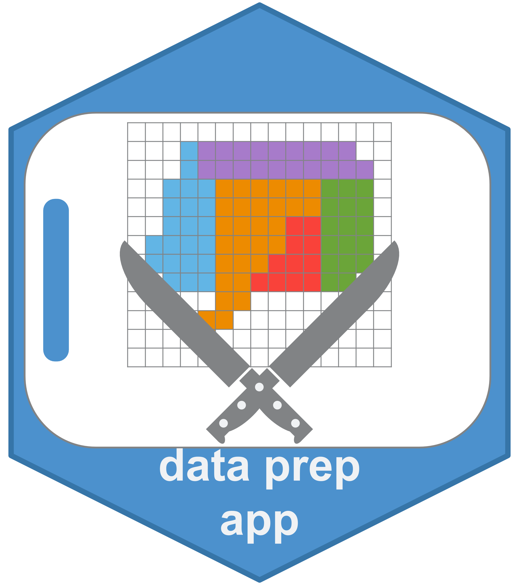

# README

Jedid Ahn & Derek Beaton, 2020OCT07

# Data Preparation (Shiny) App 

A Shiny app for data preparation, meant primarily for use with ONDRI data as part of the ONDRI NIBS standards and outliers pipeline.
